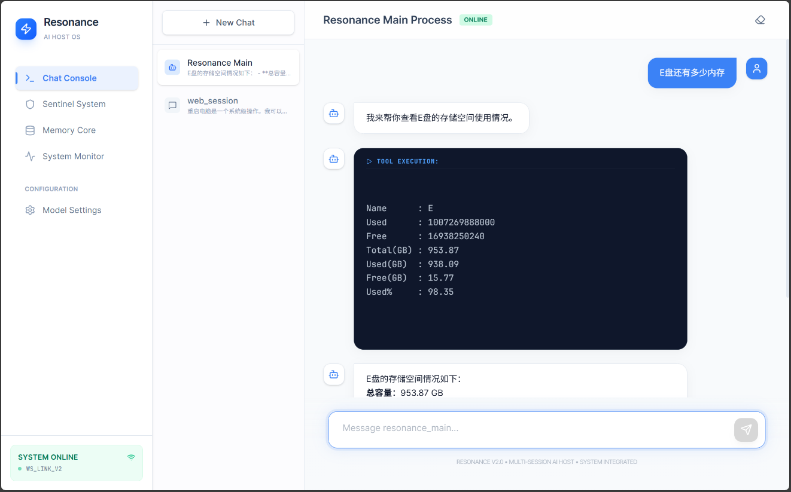
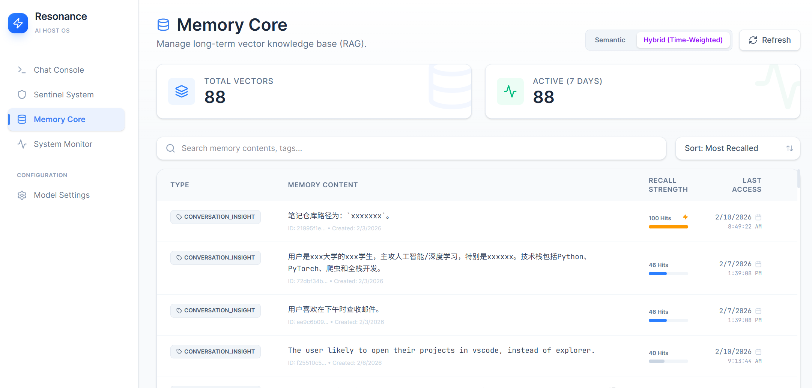

# 💠 Resonance Windows Agent

**Echoing Intelligence Locally.**  
一个专为 Windows 打造的高级本地智能体 (AI Agent) 主机。它不仅仅是聊天机器人，更是连接大模型（本地/云端）与系统底层的桥梁。

**支持 Claude Agent Skills，您可以导入任何您所想要的 SKills 立刻体验！只需把链接发给Resonance，或在配置中添加即可。**



---

## 🌟 核心特性

*   **🧠 混合大脑架构**：无缝切换本地模型 (Ollama) 与云端 API (DeepSeek, GPT-4)。
*   **🛠️ 智能技能 (Skills)**：通过 Python/PowerShell 扩展 Agent 能力，支持文件管理、浏览器自动化、系统状态读取。
*   **🛡️ 哨兵系统 (Sentinels)**：自主监控时间触发器、文件变更和全局快捷键，变被动对话为主动通知。
*   **💾 向量长时记忆**：基于 ChromaDB 的 RAG 引擎，自动萃取对话中的关键事实，随时间自我进化。
*   **🖥️ 现代交互界面**：基于 Tailwind CSS v4 的极简科技感 Web 控制台。
  
---
本地存储记忆库 隐私安全不外露 此处为示例


---

## 🚀 快速开始 (Startup)

由于本项目采用前后端分离架构，开发环境下需分别启动。

### 1. 环境准备
确保已安装：
*   **Python 3.11+**
*   **Node.js 20+**
*   **Conda** (推荐)

### 2. 后端配置 (Backend)
```bash
# 进入后端目录
cd backend

# 创建并激活环境
conda create -n resonance python=3.11 -y
conda activate resonance

# 安装依赖
pip install -r requirements.txt

# 初始化配置 (从模板复制)
copy config\config.yaml.template config\config.yaml
copy config\profiles.yaml.template config\profiles.yaml

# 启动服务器 (默认端口 8000)
python server.py
```

### 3. 前端配置 (Frontend)
> **注意**：本项目使用 Tailwind CSS v4，需配合 Vite 插件运行。
```bash
# 进入前端目录
cd frontend

# 安装依赖
npm install

# 启动开发服务器 (默认端口 5173)
npm run dev
```
访问 `http://localhost:5173` 即可进入控制台。

---

## ⚙️ 配置说明

*   **`backend/config/config.yaml`**: 全局系统设置、已注册的自动化脚本（Skills）。
*   **`backend/config/profiles.yaml`**: LLM 提供商配置（API Key、Base URL、模型名称）。
*   **`backend/config/user_profile.yaml`**: 存储 Agent 记住的关于你的个人偏好和项目路径。

---

## 🛠️ 技术栈

| 模块 | 技术方案 |
| :--- | :--- |
| **Backend** | FastAPI, HostAgent (Custom Core), Psutil, Watchdog |
| **LLM Orchestration** | OpenAI SDK (Compatible with DeepSeek/Ollama) |
| **Vector DB** | ChromaDB (RAG Store) |
| **Frontend** | React 19, Vite 6, Tailwind CSS v4, Lucide Icons |
| **Communication** | WebSocket (Real-time Stream), REST API |

---

## 📅 TODO
- [ ] 支持更加精细的 RAG 检索策略
- [ ] 前端集成全局日志查看器
- [ ] 支持拖拽文件直接让 Agent 分析
- [ ] 完善可一键运行的打包版本 (PyInstaller + Vite Build)
- [ ] 修复打开Memory Core就会阻塞线程导致其他选项全部卡死的问题
- [ ] 修复Memory Core几大显示的问题，比如cpu占用率不对且只有C盘
- [ ] i18n
- [ ] 即使云端skills添加失败，也会显示成功的bug

---

**Resonance** - *Connecting your PC to the age of LLMs.*  
Developed by [JulianRyder01](https://github.com/JulianRyder01)

---

### 💡 开发贴士 (针对 UI 调试)
本项目前端使用了 **Tailwind CSS v4**。如果发现 UI 布局异常（如纯 HTML 堆叠），请确保：
1. `vite.config.js` 中已包含 `@tailwindcss/vite` 插件。
2. `src/index.css` 第一行使用 `@import "tailwindcss";` 而非旧版的 `@tailwind` 指令。
3. 每次修改配置后重启 `npm run dev`。